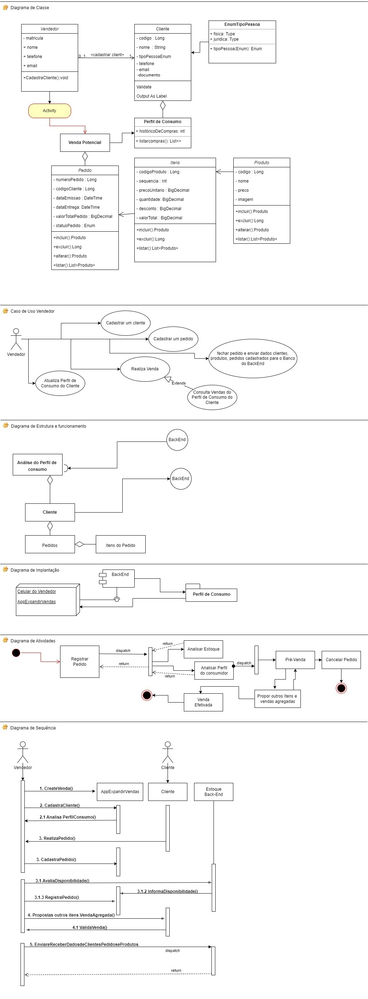
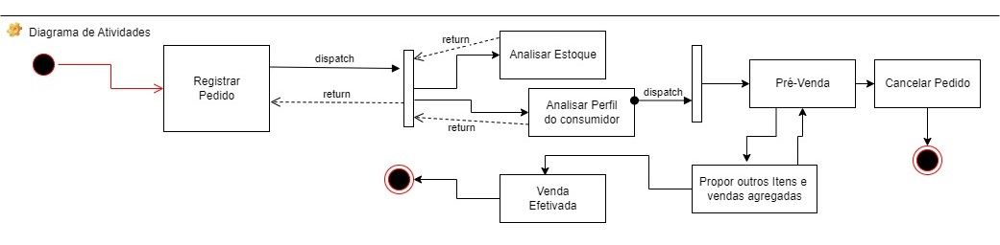
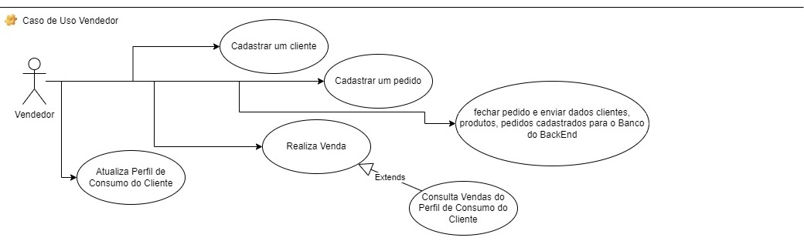
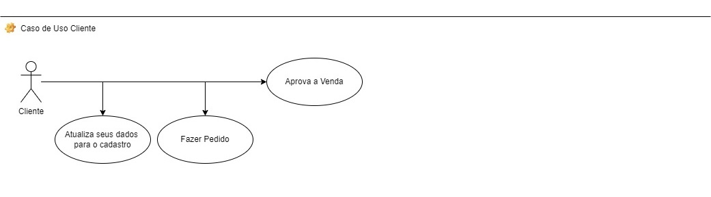
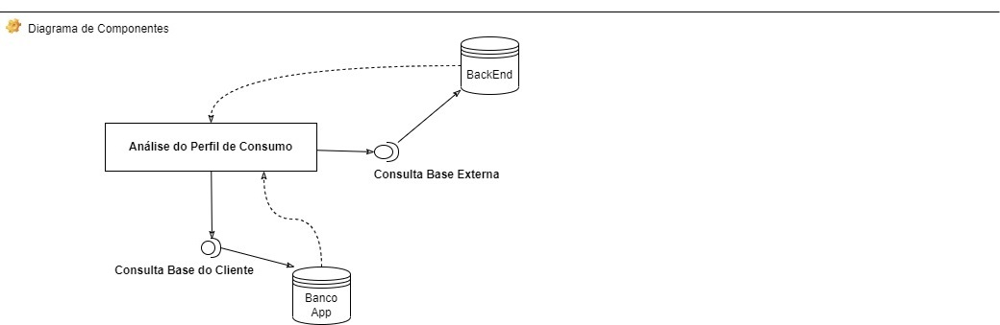

<div align="center">
  <h1>API Pedidos</h1>
  <p>
	  API desenvolvida  para enviar e receber dados de um app🤿 ☕ <br>
	  Desenvolvido com 💙 por Jefferson Cesar de Souza.<br>
	  Como Portifólio em meu Git
  </p>
</div>

## ⚙️ Funcionalidades 

- GET de 	/cliente 
		/produto
		/pedido
		/pedido-itens 
	

- POST de 	/cliente 
		/produto
		/pedido
		/pedido-itens

- PATCH 
* /cliente/{id} 
		consulta cliente por id
	
* /pedido/{id}
 		consulta pedido-de-venda por id
 		
 * /produto/{id}
 		consulta produto por id
  		
 		
		
- DELETE  	/cliente/del/{id}
 		/pedido/del/{id} 
 		/produto/del/{id}


## 🛠️ Tecnologias utilizadas

- Java 17
- Spring Boot Web, Spring Web
>> Banco de dados MongoDb

- App será feito em TotalCross Java 8

>> Banco de Dados local ( ainda estou decidindo )


## 🖥️ Diagramas UML

Diagrama de Classes



Diagrama de Atividades



Diagrama de Caso de Uso Vendedor



Diagrama de Caso de Uso Cliente



Diagrama de Componentes



#### @Document("cliente")
````
	@NotNull(message = "Por favor, informe o nome do cliente")
	private String nome_cli;
	
	@Enumerated(EnumType.STRING)
	@NotNull(message = "Por favor, informe o tipo de pessoa FISICA ou JURIDICA")
	private ClienteTipoPessoaEnum tipoPessoa_cli = ClienteTipoPessoaEnum.FISICA;

	private String telefone_cli;
	
	@Email @NotNull(message = "Por favor, informe o email do cliente")
	private String email_cli;
	
	@NotNull(message = "Por favor, informe o documento do cliente CPF ou CNPJ para pessoa Juridica")
	private String documento_cli;

````


#### POST cadastrar novo cliente
````
https://localhost:8080/cliente


    {
        "nome_cli": "Jefferson Cesar de Souza",
        "tipoPessoa_cli": "FISICA",
        "telefone_cli": "(48) 99967-9641",
        "email_cli": "jeffe.info@gmail.com",
        "documento_cli": "122.051.112-12"
    }


Response: 201 - Created

    {
        "id_cli": 1,
        "nome_cli": "Jefferson Cesar de Souza",
        "tipoPessoa_cli": "FISICA",
        "telefone_cli": "(48) 99967-9641",
        "email_cli": "jeffe.info@gmail.com",
        "documento_cli": "122.051.112-12"
    }

````

#### GET consultar lista de clientes
````
https://localhost:8080/cliente


    {
        "id_cli": 1,
        "nome_cli": "Jefferson Cesar de Souza",
        "tipoPessoa_cli": "FISICA",
        "telefone_cli": "(48) 99967-9641",
        "email_cli": "ca.info@gmail.com",
        "documento_cli": "122.051.112-12"
    },
    {
        "id_cli": 2,
        "nome_cli": "Joao Cesar",
        "tipoPessoa_cli": "FISICA",
        "telefone_cli": "(12) 11111-9641",
        "email_cli": "joao.info@gmail.com",
        "documento_cli": "122.222.444-32"
    }
    
````

#### GET consultar clientes por id
````
https://localhost:8080/cliente/1


    {
        "id_cli": 1,
        "nome_cli": "Jefferson Cesar de Souza",
        "tipoPessoa_cli": "FISICA",
        "telefone_cli": "(48) 99967-9641",
        "email_cli": "ca.info@gmail.com",
        "documento_cli": "122.051.112-12"
    }    

````


#### @Document("produto")
````
	@NotNull(message = "Por favor, informe o nome do cliente")
	private String nome_prod;
	
	@NotNull(message = "Por favor, informe o path da imagem")
	private String imagem_prod;
	
	@Min(value=0, message = "Por favor, informe o preço do produto")
	@DecimalMin(value = "0.1")
	private BigDecimal preco_prod;

````


#### POST cadastrar novo produto
````
https://localhost:8080/produto

    {
        "nome_prod": "Mouse",
        "imagem_prod": "https://images-na.ssl-images-amazon.com/images/I/51QKWGgl2rL._SY344_BO1,204,203,200_QL70_ML2_.jpg",
        "preco_prod": 1200.00
    }


Response: 201 - Created

    {
        "id_prod": 1,
        "nome_prod": "Mouse",
        "imagem_prod": "https://images-na.ssl-images-amazon.com/images/I/51QKWGgl2rL._SY344_BO1,204,203,200_QL70_ML2_.jpg",
        "preco_prod": 1200.00
    }

````

#### GET consultar lista de produtos
````
https://localhost:8080/produto


    {
        "id_prod": 1,
        "nome_prod": "Mouse",
        "imagem_prod": "https://images-na.ssl-images-amazon.com/images/I/51QKWGgl2rL._SY344_BO1,204,203,200_QL70_ML2_.jpg",
        "preco_prod": 1200.00
    },
    {
        "id_prod": 2,
        "nome_prod": "Note",
        "imagem_prod": "https://images-na.ssl-images-amazon.com/images/I/51QKWGgl2rL._SY344_BO1,204,203,200_QL70_ML2_.jpg",
        "preco_prod": 1400.00
    }
    
````

#### GET consultar produto por id
````
https://localhost:8080/produto/1

    {
        "id_prod": 1,
        "nome_prod": "Mouse",
        "imagem_prod": "https://images-na.ssl-images-amazon.com/images/I/51QKWGgl2rL._SY344_BO1,204,203,200_QL70_ML2_.jpg",
        "preco_prod": 1200.00
    }  

````


## 📒 Conteúdos  

**BackEnd**: [Consumir API cliente, produto, pedido e itenspedido e exibir dados criar um gerador de imagens para os produtos](https://github.com/JeffeDev)

**FrontEnd**: construir um APP para ler e enviar dados via Rest para o Back, utilizando ferramentas TotalCross com Spring Framework e um banco de dados NoSQL.


## 🎯 O que o projeto faz:
  - [X] CRUD (Create, Read, Update e Delete) para se poder atualizar e excluir 
  		um cliente, produto, pedido, itenspedido cadastrados;


## 📸 Screenshots
####  📌 Back-End e Front-End 
aplicação back-end usando as tecnologias Java com Spring;
aplicação mobile usando a tecnologia TotalCross;

O Modelo ER deve ser disponibilizado também no projeto do Github, 
como arquivo original da ferramenta de modelagem utilizada e também como imagem/pdf;

Deve seguir os princípios de clean code e TDD;
Deve utilizar o Maven para gerenciar as dependências;
Deve utilizar o formato JSON para integração entre as aplicações.


## ❔ Dúvidas?!
Se tiver alguma dúvida sobre este repositório, envie para jeffe.info@gmail.com


